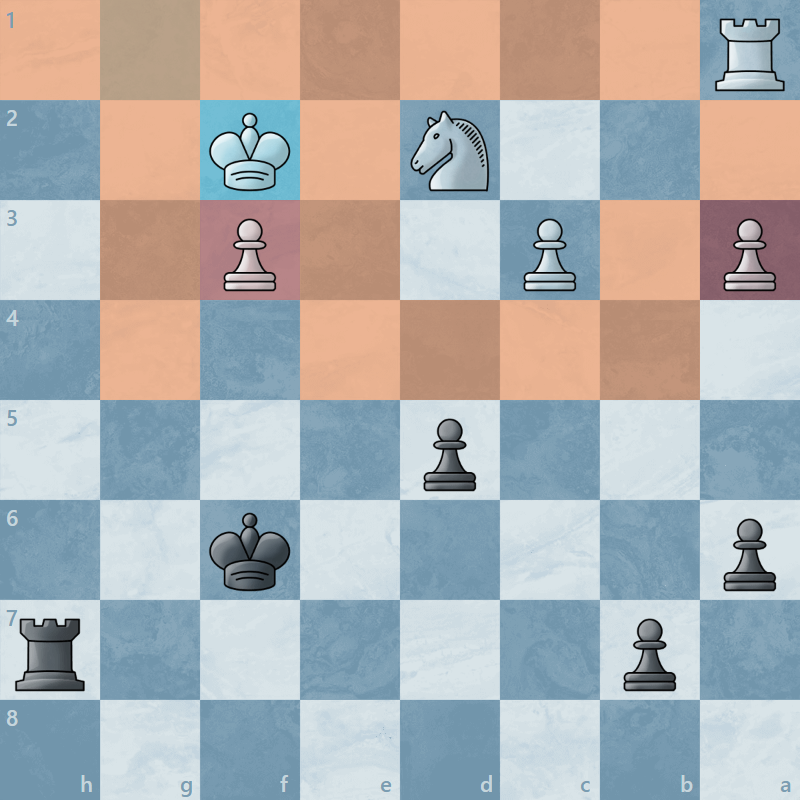

<h1 align="center">Chess Helper</h1>

A utility script for <a href="https://chess.com">chess</a>. (Tampermonkey Script / Browser Extension)

    
      
    
    
     
    
    

    

## Disclaimer
Please note, this repository is for educational and proof of concept purposes only. The information and code contained within it should not be used for any illegal or unethical activities. The contributors to this repository are not liable for any actions taken or damages caused by the use of the information or code provided here. It is the responsibility of the user to ensure compliance with all applicable laws and regulations, and to obtain any necessary permissions before using the code or information.

## How it works

### 1. Find all pieces
It searches for all pieces on the board and loops through them.

### 2. Find all possible moves
It searches for all possible moves for each piece and loops through them.

### 3. Check what the move does
Checks if the move is a capture, a protection for a piece or an empty field.

### 4. Highlight the move
Highlights the move depending on what it does.

## Usage

### Install
1. Download the [chess-helper.js](https://github.com/Lyzev/chess-helper/releases/latest) file
2. Open Tampermonkey in your Browser
3. Go to the Utilities tab
4. Press the button 'Choose File' at 'Import from file'
5. Choose the downloaded [chess-helper.js](https://github.com/Lyzev/chess-helper/releases/latest) file
6. Click on 'Install' in the tab that has opened
7. Have fun!

## Bugs and Suggestions

### Discord
If you need support, you can join [this](https://discord.gg/5UmsQP4MFH) Discord server.

### GitHub
Bug reports and suggestions should be made in this repo's [issue tracker](https://github.com/Lyzev/chess-helper/issues) using the templates provided. Please provide as much information as you can to best help us understand your issue and give a better chance of it being resolved.
